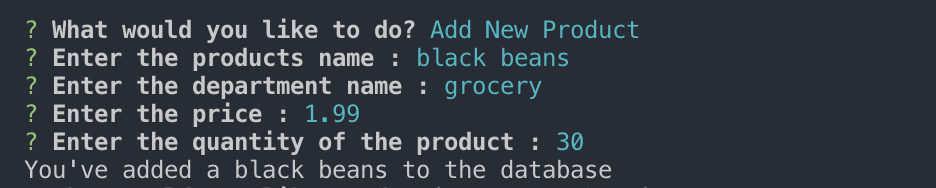

# Bamazon

## Overview

This app functions as a virtual store with customer, manager and supervisor functions. Depending on which one you're accessing the store through, you'll have the ability to purchase items, restock, add new products and/or departments, and check the listings for all of the products in the database. 

This is all done with the power of Node.js and MySQL. The database will update depending on what choices the user makes. To make the user experience better, external packages such as `inquirer ` and `console.table` have been used in production of this app.

## App in Action

Customer View - Displays lists of all products in the database

Customer Purchase - You will enter the products ID and the how many you'd like to purchase and it will display your total

Manager Menu - Displays menu options

Manager View - Shows a list of all products

Manager View Low Inventory - Shows items with a quantity less than 5

Manager Restock - Enter products ID and the amount you like to add

Manager New Product - Enter product name, department, price and quantity for the new product to be added to the database

Supervisor View - Lists name, overhead costs, sales and total profit for each department

Supervisor Create - Enter the departments name and over head cost to create a new department
